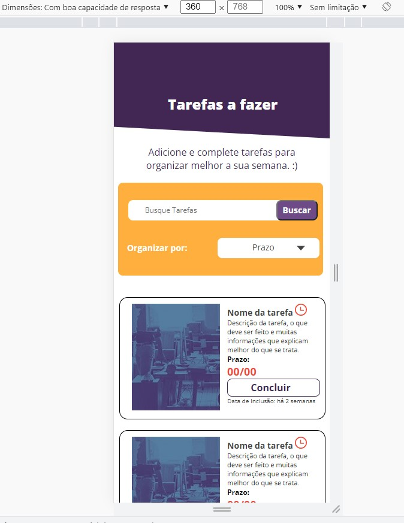
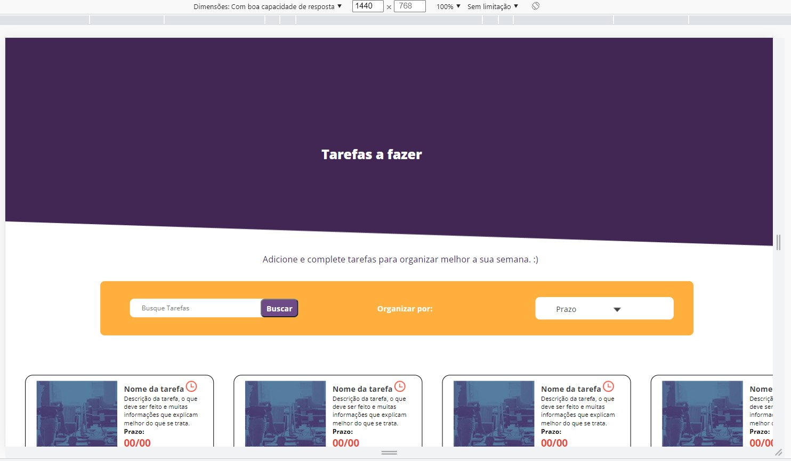

## README
  O projeto foi desenvolvido com responsividade para larguras de tela de 360px e 1440px.
   
  A responsividade para 360px está parcialmente ilustrada na imagem abaixo:
   
   
    
   
   
  A responsividade para 1440px está parcialmente ilustrada na imagem abaixo:
   
   
    

## Como executar
 

- Pode-se executar git clone ou fazer o download do projeto pelo link< https://github.com/lucaslovesdev/html-css>
- Deve-se abrir o arquivo "index.html" contido na pasta "html-css"
- Deve-se inspecionar com a ferramenta de desenvolvedor. Sendo possível assim, selecionar as larguras de tela 360px e 1440px

 

---
 

## Tecnologias utilizadas: 
 

- CSS
- HTML
- SASS

 

---
 

## Desenvolvido por:
 

  - Lucas de Souza Nogueira

 

---
 

 

 TESTE LINX

